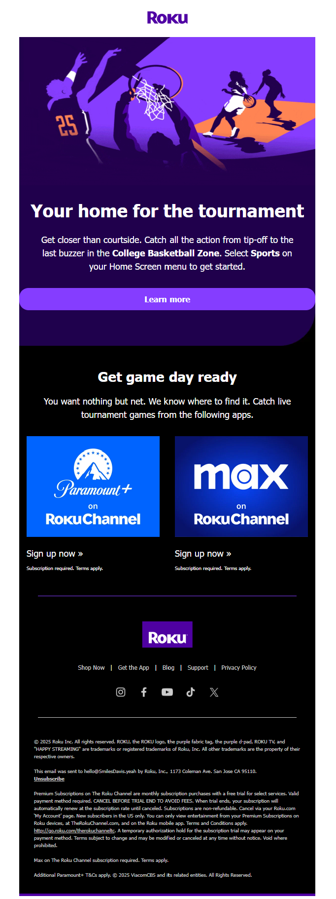
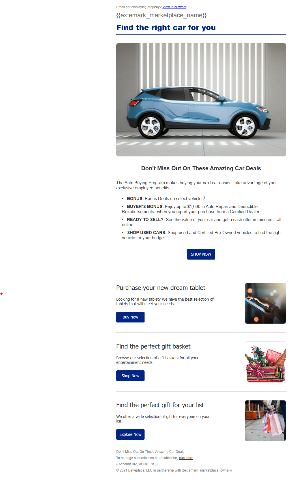

# Andrew Booker — Email Developer & Marketing Automation Specialist

I am an Email Developer with nearly 5 years of professional experience supporting the development, production, and deployment of email marketing campaigns.

My experience includes working with Salesforce Marketing Cloud and Oracle Responsys, developing and customizing responsive HTML emails, supporting dynamic and personalized content, and performing cross-client email testing and quality assurance.

I am currently available for select freelance projects and overflow email production support for agencies and marketing teams.

## Technical Skills

### Email Development
- HTML & CSS for Email
- Responsive & Mobile-Friendly Email Development
- Email Template Development & Customization
- Email Campaign Production
- Email Troubleshooting & Rendering Fixes

### Marketing Platforms
- Salesforce Marketing Cloud
- Oracle Responsys
- Dynamic Scripting Cloud

### Personalization & Dynamic Content
- AMPscript
- RPL
- Dynamic Content
- Email Personalization

### Testing & QA
- Litmus
- Email on Acid
- Cross-Client Email Testing
- Mobile & Desktop Rendering QA

### Campaign Support
- A/B Testing
- Triggered Emails
- Campaign Execution
- Email, SMS & Push Campaign Support

## Freelance Email Development Services

I provide freelance and overflow email development support for agencies, marketing teams, and businesses that need additional production capacity.

### Responsive HTML Email Development

Have a completed email design that needs to be built?

I can turn completed designs and creative assets into responsive, production-ready HTML emails.

**Clients provide:**

- Completed email design or design file
- Images and creative assets
- Final copy
- Destination URLs

**I provide:**

- Responsive HTML email development
- Mobile optimization
- Email template customization
- Cross-client compatibility support
- Email QA and troubleshooting
- Clean HTML handoff

### Email Campaign Production

For teams with established email templates and design systems, I can provide overflow campaign production support.

This can include:

- Building campaigns using existing templates and modules
- Updating copy, images, links, and CTAs
- Customizing existing email layouts
- Preparing campaigns for deployment
- Performing pre-send QA and testing

### Email QA & Troubleshooting

I can troubleshoot existing HTML emails and help resolve issues involving:

- Mobile responsiveness
- Desktop and mobile rendering
- Layout inconsistencies
- Broken links or images
- Template and module issues
- Cross-client compatibility

### Marketing Automation Platform Support

I have professional experience working with:

- Salesforce Marketing Cloud
- Oracle Responsys
- AMPscript
- RPL
- Dynamic Content
- Triggered Emails

Support is available based on individual project requirements.

## Portfolio

Below are examples of responsive HTML emails I have developed and coded.

### Roku March Madness Campaign

A custom promotional email developed to recreate a Roku March Madness campaign. This project demonstrates responsive HTML email development, mobile optimization, structured content modules, and promotional CTA implementation.

  

[View Live Email](YOUR_LIVE_LINK) | [View Source Code](YOUR_SOURCE_LINK)

---

### Auto Buying Program Email

A responsive marketing email featuring dynamic content placeholders and multiple promotional content modules. This project demonstrates modular email development, responsive layouts, CTA implementation, and dynamic content integration.

  

[View Live Email](YOUR_LIVE_LINK) | [View Source Code](YOUR_SOURCE_LINK)

## Tools & Technologies

- HTML
- CSS
- AMPscript
- RPL
- Salesforce Marketing Cloud
- Oracle Responsys
- Dynamic Scripting Cloud
- Litmus
- Email on Acid
- Dreamweaver
- GitHub

## Work With Me

I am currently available for select freelance email development projects and overflow campaign production support.

If your agency or marketing team needs additional support building, customizing, testing, or troubleshooting email campaigns, I would be happy to discuss your project.

**LinkedIn:** [Andrew Booker](https://www.linkedin.com/in/andrew-booker)
